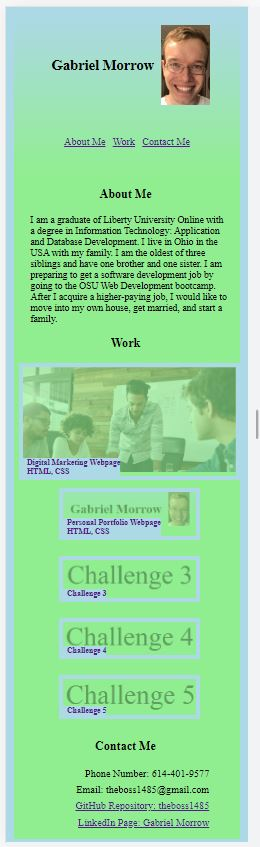

# Portfolio Showcase Webpage

## Description

My motivation to build this project was so that I could increase my knowledge of HTML and CSS, and also to learn about how to employ responsive design principles.  I also built this project in order to better prepare myself for a software develpment job. This project is a webpage showcasing my personal software development projects.  The webpage solves the problem of an employer needing to have a job candidate's portfolio in one place.  It has images from projects that I have built, and if the user clicks on an image, he or she will be taken to the GitHub repository of the project.  As of now, not all of the images on the page lead to actual projects, since I am not far enough into the bootcamp I am taking. However, this will change as time goes on. In this project I learned about how to make responsive web pages and how to employ flexbox properly. I also had a little bit of practice with using psuedo classes.

## Table of Contents (Optional)

This README isn't that long, so N/A.

## Installation

N/A

## Usage

Here is a screenshot of the Portfolio Showcase Webpage.  Unfortnately I could only get it to fit in the height of 
the screen by shrinking the width drastically:  

Here is a link to the deployed webpage: [Portfolio Showcase Webpage](https://theboss1485.github.io/portfolio-showcase-webpage/)

## Credits

I didn't have any collaborators on this project.

## License

This project is under an MIT license.  Please see the license in the GitHub repository for more information.

## Badges

I have no badges to display.

## Features

This webpage has cickable links and a responsive page design.

## How to Contribute

This was an assignment that I personally completed, so N/A.

## Tests

N/A